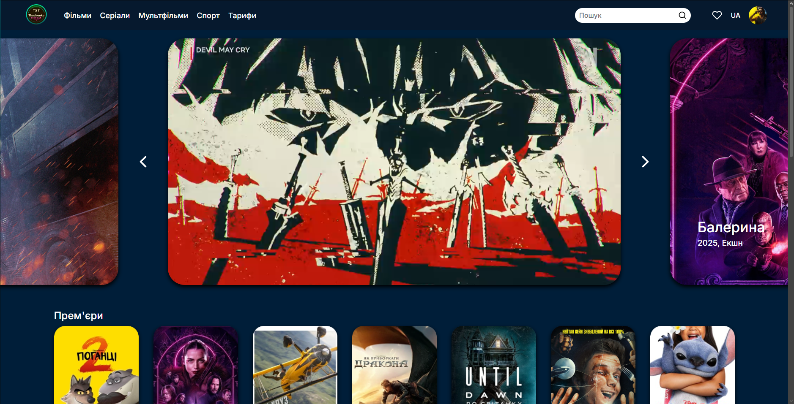
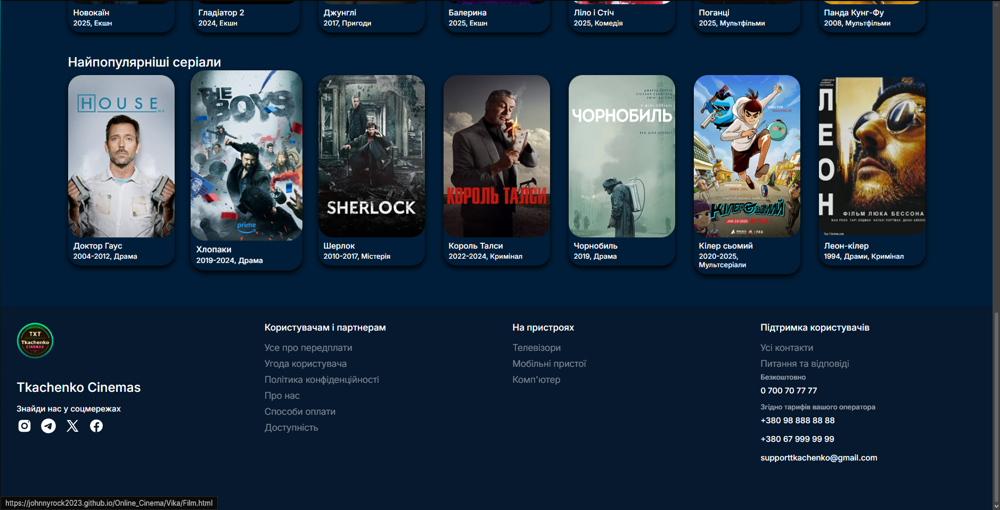
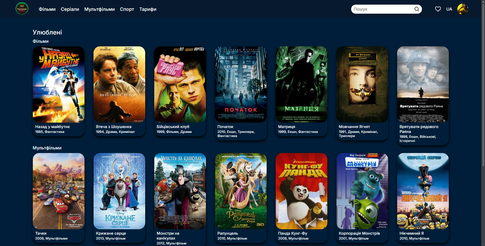

# 🎬 Online Cinema Website

This is an educational web design project created as part of a university coursework assignment. It simulates an online movie streaming platform and provides a modern, user-friendly interface for browsing movies and TV shows.

## Features

* Responsive design
* Movie catalog page
* Movie details page
* Navigation menu
* Modern UI layout

## Technologies Used

* HTML5
* CSS3
* JavaScript

## Getting Started

1. Clone the repository:

   ```bash
   git clone https://github.com/JohnnyRock2023/Online_Cinema.git
   ```

2. Open `index.html` in your browser.

## Screenshots
  
### Home Page



### Liked Movies


## Authors

Roman Kutsenko  
Viktoria Pavlenko  
Valeria Temchur  
